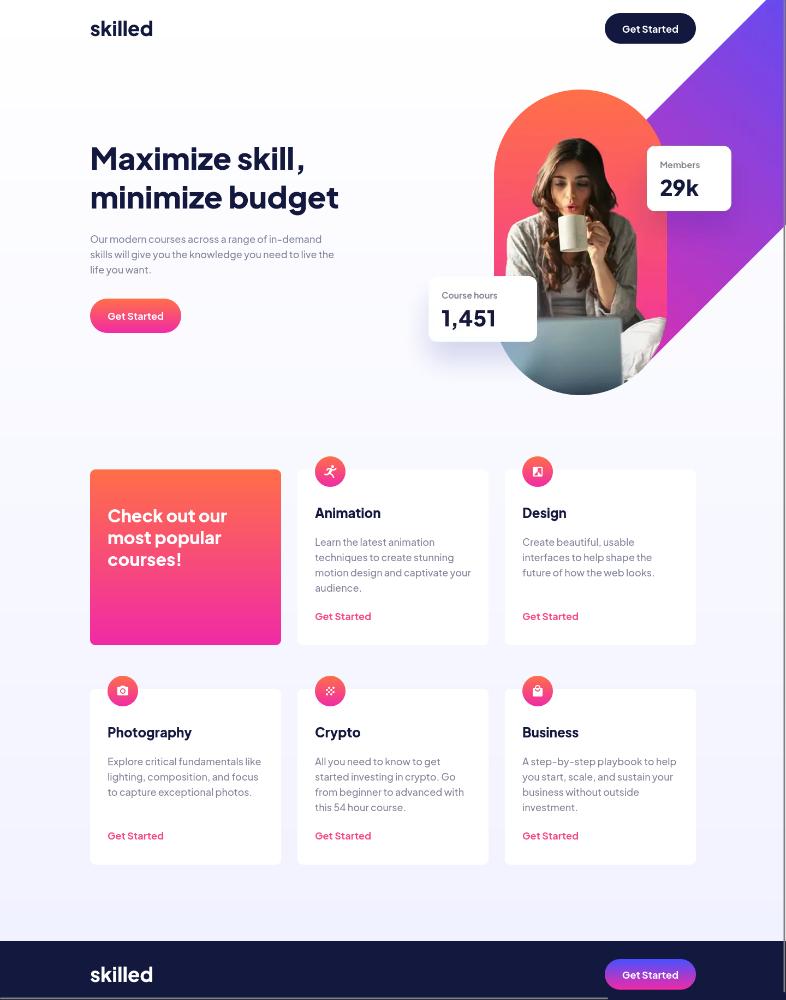

# Frontend Mentor - Skilled e-learning landing page solution

This is a solution to the [Skilled e-learning landing page challenge on Frontend Mentor](https://www.frontendmentor.io/challenges/skilled-elearning-landing-page-S1ObDrZ8q). Frontend Mentor challenges help you improve your coding skills by building realistic projects.

## Table of contents

- [Overview](#overview)
  - [The challenge](#the-challenge)
  - [Screenshot](#screenshot)
  - [Links](#links)
- [My process](#my-process)
  - [Built with](#built-with)
  - [What I learned](#what-i-learned)
  - [Continued development](#continued-development)
- [Author](#author)

## Overview

### The challenge

Users should be able to:

- View the optimal layout depending on their device's screen size
- See hover states for interactive elements

### Screenshot

### Links

- Solution URL: [https://github.com/teempe/frontend-metor-skilled-elearning-landing-page.git](https://github.com/teempe/frontend-metor-skilled-elearning-landing-page.git)
- Live Site URL: [https://teempe.github.io/frontend-metor-skilled-elearning-landing-page/](https://teempe.github.io/frontend-metor-skilled-elearning-landing-page/)

## My process

### Built with

- Semantic HTML5 markup
- CSS custom properties
- Flexbox
- CSS Grid
- Mobile-first workflow

### What I learned

Getting familiar with building bigger layouts with grid and flexbox.

### Continued development

As I grasp of some fundamentals of grid and flexbox, still need more practice with them, with sizing and positioning elements within layout.

## Author

- Website - [teempe](https://github.com/teempe)
- Frontend Mentor - [@teempe](https://www.frontendmentor.io/profile/teempe)
